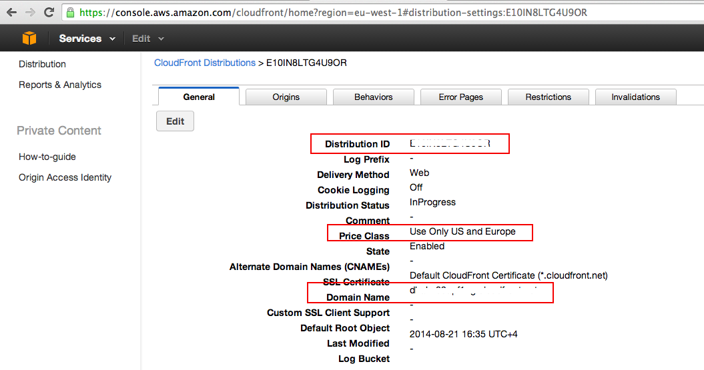

[Оглавление](/README.md) | [Далее](proxy.md "Настройка прокси")

#Подготовка
 
Все шаги перечисленные ниже производятся в панели управления [Amazon Web Services](https://console.aws.amazon.com).

## S3

### Создание бакета

Заходим в консоль Амазона, переходим в настройки S3.

Чтобы создать бакет нажимаем на `Create Bucket`:

В открывшемся окне вводим название бакета и выбираем регион `Ireland` (он ближе всего к нашим серверам).

Имя бакета должно быть уникальным, в соответствии с ним создается поддомен вида `bucketname.s3.amazonaws.com`, по которому будут доступны наши файлы. Жмем `Create`.

Если имя бакета не уникально, то будет выведена ошибка.

После создания новый бакет появится в списке слева.

### Открытие публичного доступа на чтение

Чтобы файлы, находящиеся в бакете были публично доступны по прямой ссылке необходимо добавить глобальное разрешение в меню `Properties` выбранного бакета.

По умолчанию авторизованному супер-пользователю доступны все действия с бакетом и объектами в нем.

Чтобы добавить разрешение на чтение файлов для анонимных пользователей выбираем `Add more permissions`, в поле `Grantee` выставляем `Everyone` и ставим флаг `View Permissions`. Сохраняем изменения.

## Настройка доступа

Для того чтобы работать с API Amazon Web Services необходимо создать группу, выставить групповые права, создать пользователя и добавить его в группу.

Для управления пользователями в Amazon используется сервис `Identity and Access Management` (IAM).

### Создание группы

Создаем группу перейдя в панель управления группами IAM и нажав `Create New Group`.

Вводим имя группы.

Далее необходимо указать, какие действия и над какими объектами разрешены пользователям группы.

Нам потребуются разрешения на получение списка файлов, чтение, загрузку, удаление и изменение прав файлов.

Этим требованиям соответствуют права:

- ListBucket  
- GetObject  
- PutObject  
- DeleteObject  
- GetObjectAcl  
- PutObjectAcl  

Чтобы сгенерировать файл с правами, выбираем пункт `Policy Generator`.

Указываем сервис `Amazon S3` и выбираем указанные выше действия в списке `Actions`.

В поле `Amazon Resource Name (ARN)` нужно указать путь до ресурса, в нашем случае это бакет S3.

Название ресурса указывается в формате `arn:aws:SERVICE_NAME:::RESOURCE_NAME`,
соответсвенно SERVICE_NAME - s3, а RESOURCE_NAME - название бакета, выбранное при создании.

Допустим бакет называется *mybucket*, в таком случае ARN будет *arn:aws:s3:::mybucket*.

В результате сгенерируется файл с правами, но нам необходимо добавить одну строчку, чтобы все заработало.

В разделе `Resource` необходимо продублировать строчку с ресурсом `"arn:aws:s3:::RESOURCE_NAME"`, но добавив в конце `/*`. Таким образом указанные права будут распространяться не только на сам ресурс (бакет S3 в нашем случае), но так же и на все его содержимое (файлы). В итоге у нас должно быть два ресурса - `"arn:aws:s3:::RESOURCE_NAME"` и `"arn:aws:s3:::RESOURCE_NAME/*"`, где RESOURCE_NAME - название нашего бакета.

### Создание пользователя

Переходим в раздел управления пользователями и нажимаем `Create New Users`.

Вводим имя пользователя, убеждаемся что стоит флаг `Generate an access key for each user` и нажимаем `Create`.

В скрытом поле указаны два ключа - `Access Key ID` и `Secret Access Key`. По сути это логин и пароль для работы с API. Сохраняем их в надежном месте.

### Добавление пользователя в группу

Выбираем созданного пользователя и добавляем его в группу.

## CloudFront

### Схема работы

CloudFront - это CDN от Amazon'а. По сути это географически распределенный файловый кеш. 

Схема его работы следующая.

Исходный файл существует в единственном экземпляре и хранится в бакете S3, например в Ирландии. В свою очередь у нас настроен CloudFront с серверами в Северной Америке и Европе. В зависимости от того, где находится пользователь запрашивающий файл, он с помощью geo DNS попадает на ближайший к нему сервер CloudFront'а. Сервер сначала ищет файл в своем кеше, и если он находится (cache hit), то сразу отдает его пользователю. В случае, если файла в кеше нет (cache miss), то CloudFront идет к источнику (origin), в нашем случае это бакет S3, скачивает и сохраняет в кеш.

Соответственно вместо ссылки на файл в бакете (`http://mybucket.s3.amazonaws.com/boobs.jpg`) мы должны давать пользователю ссылку на CloudFront (`http://adns8979ascnvhasd3.cloudfront.com/boobs.jpg`).

### Создание дистрибуции

Переходим в панель управления CloudFront.

Создаем дистрибуцию.

Выбираем тип `Web`.

В разделе `Origin Settings` указывается источник, где лежат исходные файлы.

В выпадающем списке `Origin Domain Name` выбираем созданный нами бакет вида `BUCKET_NAME.s3.amazonaws.com`.

Значение в поле `Origin ID` будет сгенерировано автоматически.

Оставляем все по дефолту кроме поля `Price Class` в разделе `Distribution Settings`.

В зависимости от требований можно выбрать в скольких регионах будут находится CDN серверы, соответственно чем больше серверов, тем выше плата за использование. Чтобы сократить стоимость укажем `Use Only US and Europe`. Если выбрать `Use All Edge Locations`, то наши файлы будут кешироваться на всех континентах. Полный список регионов указан [здесь](http://aws.amazon.com/cloudfront/details/).

В поле `Alternate Domain Names (CNAMEs)` можно указать свой красивый домен, который будет использоваться в публичных ссылках на файлы, например `cdn.example.com`. Об этом чуть позже.

Создаем дистрибуцию нажав `Create Distribution`.

В списке мы видим, что наша дистрибуция находится в статусе `In Progress`. Когда статус будет `Deployed` мы сможем протестировать работу.

### Добавление нашего сервера в дистрибуцию

Дистрибуцию нужно настроить таким образом, чтобы CloudFront в случае, если файла по какой-то причине еще нет на S3, брал его с нашего исходного сервера.

Для этого выберем созданную дистрибуцию и отредактируем настройки нажав `Distribution Settings`.

Во вкладке `General` указан созданный для дистрибуции домен вида `xxxxxxxx.cloudfront.com` (поле `Domain Name`).

Список исходных серверов настраивается в вкладке `Origins`.

Добавим наш сервер в качестве исходного.

В поле `Origin Domain Name` указываем домен, по которому доступен наш сервер. Поле `Origin ID` подставится автоматически. Сохраняем нажав `Create`.

Во вкладке `Behaviors` указаны правила, по которым CloudFront будет искать файл, если его нет в кеше. Создадим новое правило для нашего сервера.

Поле `Path Pattern` определяет маску файла для правила. В нашем случае интересуют все файлы, поэтому указываем `*`.

Это фича нужна, когда например у нас файлы .css лежат не на том же сервере, где картинки .jpg Тогда для одного сервера указываем правило *.css, для другого *.jpg. Подробнее про формат маски можно почитать [здесь](http://docs.aws.amazon.com/AmazonCloudFront/latest/DeveloperGuide/distribution-web-values-specify.html#DownloadDistValuesPathPattern).

В выпадающем списке `Origin` выбираем добавленный на предыдущем шаге сервер.

Сохраняем конфигурацию и переходим к тестированию.

## Тестирование конфигурации

### S3+CloudFront

Для начала проверим, что правильно настроена связка S3+CloudFront.

Переходим в панель управления S3, в левом меню выбираем созданный нами бакет, в выпадающем меню `Actions` выбираем `Upload`.

Добавляем файл `Add Files`.

Переходим во вкладку `Set Details` и далее в `Set Permissions` и выставляем флаг `Make everything public`, загружаем `Start Upload`.

Проверяем, что файл доступен по прямой ссылке на S3 `http://BUCKET_NAME.s3.amazonaws.com/elephpant.png`, где BUCKET_NAME - название бакета.

Дальше проверяем, что файл доступен по ссылке на CloudFront `xxxxxxxxxxx.cloudfront.net/elephpant.png`.

Этот тест провалится, потому что у нас еще не настроен прокси. Об этом в [следующем разделе](proxy.md).

[Оглавление](/README.md) | [Далее](proxy.md "Настройка прокси")