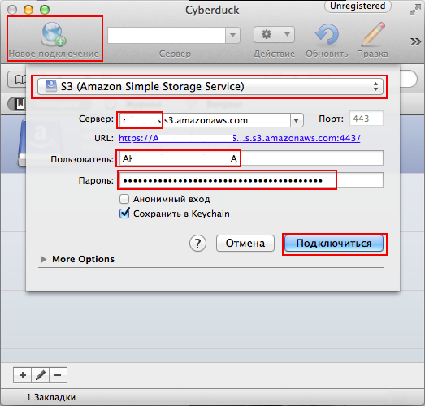

# Инструменты и библиотеки для работы с S3

## Графические утилиты

### Cyberduck

Легкая бесплатная программа для Windows и Mac OS X.

[https://cyberduck.io/](https://cyberduck.io/)



Создаем `Новое подключение`, выбираем `S3`, вводим полный путь до бакета в формате `bucket.s3.amazonaws.com`, в качестве имени пользователя вводим `Access Key ID`, в качестве пароля `Secret Access Key`, полученные на этапе [подготовки](setup.md).

## Библиотеки

### Python

#### Boto

Boto - библиотека на Python предоставляющая интерфейс для Amazon Web Services.

Публичный репозиторий - [https://github.com/boto/boto](https://github.com/boto/boto)

Документация - [http://docs.pythonboto.org/en/latest](http://docs.pythonboto.org/en/latest)

Единственное требование - Python 2.6/2.7, частично поддерживвается Python 3.3/3.4.

Устанавливается Boto с помощью питоновского менеджера пакетов [pip](https://pip.pypa.io/en/latest/index.html).

##### Установка pip

**Aptitude (Debian and Ubuntu)**

```
$ sudo apt-get install python-pip
```

**Yum (CentOS, Fedora)**

```
$ sudo yum install python-pip
```

**FreeBSD**

```
$ cd /usr/ports/devel/py-pip/ && make install clean
```


##### Устанавка boto

```
$ pip install boto
```

### PHP

#### Amazon Web Services SDK


## Консольные утилиты

### s3put

Коносльная утилита для закачки файлов на S3 на Python; поставляется вместе с Boto.

Мы ее будем использовать для переноса файлов с сервера на S3.

#### Установка

Тулзу можно использовать сразу после установки boto.

Но нам необходимо не только копировать файлы на S3, но и удалять их. Текущая релизация этого не умеет, поэтому надо заменить ее [моей версией](https://github.com/meetmatt/s3put/blob/master/bin/s3put).

Сначала убедимся, что исходный s3put лежит в `/usr/local/bin`. Если все окей, то заменяем его моим:

```
$ cd /usr/local/bin
$ sudo cp s3put s3put.backup
$ sudo wget https://raw.githubusercontent.com/meetmatt/s3put/master/s3put.py -O s3put
$ sudo chmod +x s3put
```

Проверяем:

```
$ s3put | grep delete
          [--header] [--region <name>] [-x/--delete] [--host <s3_host>] path [path...]
        delete - delete local file after successfull upload 

```

#### Использование

Нас интересуют параметры:

* **-a/--access_key** - Access Key ID
* **-s/--secret_key** - Secret Access Key
* **-b/--bucket** - название бакета
* **--region** - сокращенное название региона (колонка *Region* в [таблице](http://docs.aws.amazon.com/general/latest/gr/rande.html#s3_region))
* **--delete** - удалить файлы после загрузки
* **--grant** - изменить ACL файла
* **--prefix** - префикс, который будет удален из пути файла

Допустим мы хотим переместить фотографии юзеров из папки `/var/www/site/public/uploads/images`.

Ссылка на файл сейчас выглядит так: `http://example.com/uploads/images/boobs.jpg`.

Нам надо, чтобы файл был доступен по ссылке `http://example.s3.amazonaws.com/uploads/images/boobs.jpg`.

Тогда в качестве параметра `prefix` должно быть указано `/var/www/site/public/`.

Так выглядит вызов s3put в нашем случае:

```
$ s3put --access-key LUGMNMH7B372CDN1F654 \  
        --secret-key oUkLK/9SAsU9uYwQV4oO+9iLPO3bwyVbz6yBEaaY \  
        --bucket example \  
        --region='eu-west-1' \  
        --grant='public-read' \  
        --prefix='/var/www/site/public/' \  
        --delete \  
        /var/www/site/public/uploads/images/
```

В случае CloudFront файл будет доступен по ссылке `http://xxxxxxx.cloudfront.com/uploads/images/boobs.jpg`.

Если указать путь до файла, то скопируется только он, если до директории, то рекурсивно скопируются все файлы и поддиректории в ней.

#### Пример использования

Скачаем какой-нибудь файл во временную директорию (здесь и далее используется Linux):

```
$ mkdir -p /tmp/public/uploads/images
$ wget http://a0.awsstatic.com/main/images/logos/aws_logo.png -O /tmp/public/uploads/images/boobs.png
```

Узнаем размер файла, чтобы потом сравнить с тем, что попадет на S3:

```
$ ls -nl /tmp/public/uploads/images/aws_logo.png | awk '{print $5}'
6258
```

Переместим файл на S3:

```
$ s3put --a LUGMNMH7B372CDN1F654 -s oUkLK/9SAsU9uYwQV4oO+9iLPO3bwyVbz6yBEaaY -b example --region='eu-west-1' --grant='public-read' --prefix='/tmp/public/' --delete /tmp/public/uploads/images/
Copying /tmp/public/uploads/images/aws_logo.png to example/uploads/images/aws_logo.png
Upload complete
Removing /tmp/public/uploads/images/aws_logo.png
```

Если s3put выдает ошибку `RequestTimeTooSkewed`, значит серверное время слишком расходится с временем Амазона. Синхронизируем часы по NTP:

```
$ sudo ntpdate 0.pool.ntp.org
```

Проверим, что файл был удален:

```
$ ls -l /tmp/public/uploads/images/
total 0
```

Проверим размер файла на S3:

```
$ curl -I http://example.s3.amazonaws.com/uploads/images/aws_logo.png 2>&1 | grep Content-Length | awk '{print $2}'
6258
```

Вместо последнего шага можно просто открыть картинку в браузере `http://example.s3.amazonaws.com/uploads/images/aws_logo.png` или в Cyberduck.


